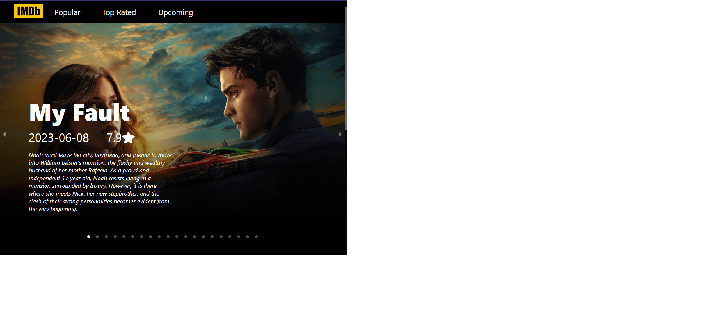
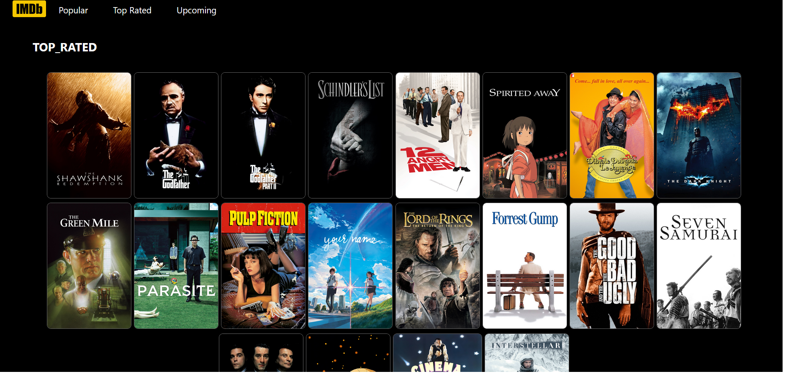

⭐TMDB IMDb Clone⭐

A visually stunning and feature-rich web application that replicates IMDb functionality, using The Movie Database (TMDB) API for real-time movie data.

🌟 Features

🎬 Discover Movies and TV Shows: Browse trending movies, top-rated films, and upcoming releases.

🔍 Search Functionality: Easily find movies, TV shows, and actors.

📃 Detailed Pages: View in-depth details about movies, including cast, trailers, and reviews.

⭐ Add to Favorites: Save your favorite movies and shows.

🎥 Responsive Design: Fully optimized for desktop, tablet, and mobile.

🚀 Live Demo

Check out the live version here: (https://roy-imdb-clone.netlify.app/)

🛠️ Built With

Frontend: React, React Router, CSS

Backend/Services: TMDB API

Package Manager: npm

🖼️ Screenshots

     
     
     

📦 Installation and Setup

Clone the repository:

git clone https://github.com/Roychen651/imdb-clone.git

Navigate to the project directory:

cd imdb-clone

Install dependencies:

npm install

Add your TMDB API key:

Create a .env file in the root directory.

Add the following line:

REACT_APP_TMDB_API_KEY=your_tmdb_api_key

Start the development server:

npm start

Open your browser and visit:

http://localhost:3000

🧪 Testing

Run the following command to execute tests:

npm test

📂 Project Structure

├── src
│ ├── components # Reusable React components
│ ├── pages # Pages for routing
│ ├── services # API calls
│ ├── context # State management with Context API
│ └── assets # Images and static assets
├── public # Public files
├── .env # Environment variables
├── package.json # Dependencies and scripts
└── README.md # Project documentation

🌐 API Integration

This project uses TMDB API for fetching movie data. You need to sign up for an API key and add it to your .env file as shown above.

🗺️ Roadmap

🤝 Contributing

Contributions are welcome! If you'd like to improve this project, follow these steps:

Fork the repository.

Create a new branch (git checkout -b feature-branch-name).

Commit your changes (git commit -m 'Add some feature').

Push to the branch (git push origin feature-branch-name).

Open a Pull Request.

📄 License

This project is licensed under the MIT License - see the LICENSE file for details.

💬 Acknowledgments

The Movie Database (TMDB) for the API.

Create React App for bootstrapping the project.

Inspiration from IMDb and other movie database platforms.
